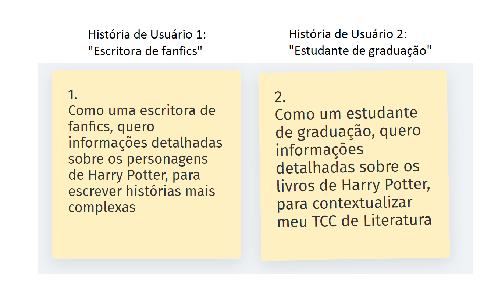
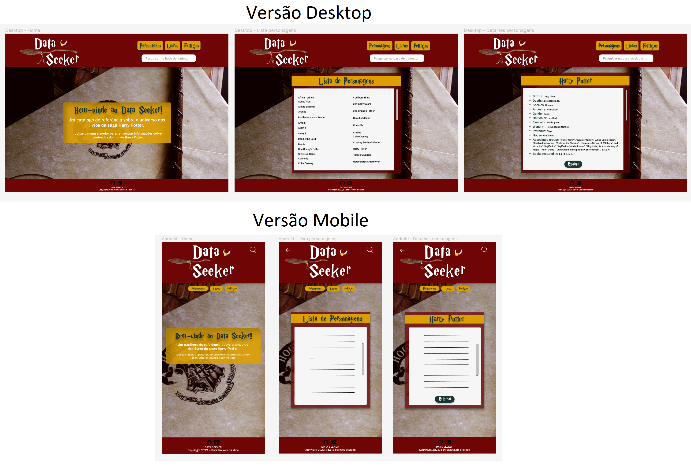

# Data Lovers

## Índice

* [1. Preâmbulo](#1-preâmbulo)
* [2. Resumo do projeto](#2-resumo-do-projeto)
* [3. Objetivos de aprendizagem](#3-objetivos-de-aprendizagem)
* [4. Considerações gerais](#4-considerações-gerais)
* [5. Critérios mínimos de aceitação do
  projeto](#5-critérios-mínimos-de-aceitação-do-projeto)
* [6. Hacker edition](#6-hacker-edition)
* [7. Considerações técnicas](#7-considerações-técnicas)
* [8. Pistas, dicas e leituras
  complementares](#8-pistas-dicas-e-leituras-complementares)
* [9. Checklist](#9-checklist)

***

## 1. Preâmbulo

Segundo a
[Forbes](https://www.forbes.com/sites/bernardmarr/2018/05/21/how-much-data-do-we-create-every-day-the-mind-blowing-stats-everyone-should-read)
90% dos dados que existem hoje foram gerados durante os últimos dois anos. A
cada dia geramos 2.5 milhões de terabytes de dados, uma cifra sem precedentes.

Apesar disso, os dados por si só são de pouca utilidade. Para que essas grandes
quantidades de dados se convertam em **informação** compreensível para os
usuários, precisamos entender e processar estes dados. Uma forma simples de
fazer isso é criando _interfaces_ e _visualizações_.

Na imagem seguinte, você pode ver como os dados que estão na parte esquerda
podem ser usados para construir a interface amigável e compreensível que está na
parte direita.

## 2. Resumo do projeto

O Data-lovers é o segundo projeto de uma _página web_, desenvolvido durante o Bootcamp da turma SAP008, da Laboratória Brasil.

Este projeto se trata de uma aplicação web de manipulação de um aglomerado de dados, previamente disponibilizado no repositório da Laboratória. Para o nosso projeto, escolhemos trabalhar com os dados da temática Harry Potter. 

Para a elaboração do projeto, utilizamos as ferramentas Notion (para o planning das tasks), Metroretro (para a construção das histórias de usuários e para as retrospectivas de nossas sprints) e Figma (para o protótipo navegável de alta fidelidade). Ademais, para a criação da página, utilizamos HTML, CSS, JavaScript Vanilla e Jest como ferramentas de programação. 

Para a criação de um projeto que atendesse às necessidades dos usuários, criamos um protótipo de alta fidelidade navegável. Através deste protótipo, pudemos realizar um teste de usabilidade, para a qual recebemos feedbacks que foram implementados no nosso produto final.

Ademais, a lógica do projeto foi construída com base na manipulação de dados previamente selecionados de acordo com as histórias de usuário criadas, de modo que os filtros escolhidos (personagens, livros e feitiços) foram selecionados com base nas necessidades dos nossos usuários, além da inclusão de mudanças na interface vindas dos feedbacks do teste de usabilidade. 

## 3. Histórias de Usuário

As histórias dos nossos usuários foram pensadas de acordo com a temática que escolhemos, a da saga de livros "Harry Potter", da autora J.K Rolling. Além disso, criamos as histórias a partir de um escopo de Metodologia Ágil, sob uma perspectiva objetiva e clara de usuário. Sendo assim, criamos duas histórias, considerando como nossa página poderia entregar um valor particular a esses usuários, ao atender suas demandas e necessidades.  

Para a escrita das histórias, decidimos por uma liguagem simples e de poucas senteças, com descrições breves, claras e concisas, sobre as necessidades dos nossos usuários. Com o intuito de que cada uma de nossas histórias coubesse em post-its, utilizamos a ferramenta Metroretro para escrevermo-las. 

Sendo assim, o resultado final do processo de criação das nossas histórias de usuário pode ser observado abaixo:

## 4. Processo de prototipação

Nosso processo de prototipação foi dividido em etapas, tendo sido eleito como a primeira task a ser terminada em nosso planning. Sendo assim, se deu pelas seguintes etapas: protótipo de baixa fidelidade; protótipo de alta fidelidade, com ambas versões Mobile e Desktop; protótipo de alta fidelidade navegável. 

Primeira etapa: desenhamos nossa interface no papel apresentando elementos básicos que nossos usuários precisariam para navegar na nossa página: botões para cada seção de dados, e a disposição de informações em cards.

Segunda etapa: criamos nossa interface no Figma. Além disso, considerando a diversidade de nossos usuários, adotamos uma perspectiva de Design Responsivo e de acessibilidade para criação de nosso protótipo no Figma. Nesse sentido, adotamos a ótica Mobile First, de modo que, primeiramente, criamos nosso protótipo em versão Mobile, e, com base nesses resultados, prototipamos nossa versão Desktop. Implementando as seguintes mudanças:

1. Elegemos nossos elementos de design (paleta de cores, fonte, imagem de fundo, nome e logo) para que trouxessem o elemento de identidade que remetesse ao universo dos livros da saga. 
2. Disposição dos dados principais em listas, visando organização e facilidade para a consulta e escolha dos dados pelo usuário;
3. Disposição dos dados informativos em cards, objetivando maior conforto e precisão na leitura do texto;
4. Incluímos um botão de "Retornar", para facilitar a navegação do usuário para a página anterior, caso necessitasse consultar informativos de outros dados principais;
5. Adicionamos uma barra de pesquisa, para entregar maior praticidade à experiência do usuário, sem que ele precisasse, obrigatoriamente, navegar por cada seção para encontrar o dado desejado.

Terceira etapa: tornamos nosso protótipo navegável.

## 5. Testes de usabilidade

Durante a criação do protótipo de alta fidelidade, conduzimos um teste de usabilidade com dois usuários, com o objetivo de verificar se o protótipo que estávamos criando atenderia às funcionalidades esperadas. Para o teste, apresentamos a tarefa de que, através do protótipo navegável, eles acessassem o card que exibe informações detalhadas do personagem "Harry Potter".  

Após a realização do teste, solicitamos aos usuários seus feedbacks com relação à usabilidade, considerando os níveis de acessibilidade e intuitividade apresentados na página. Com o feedback, buscamos entender quais dificuldades eles encontraram; quais features da página apresentaram maior valor para a usabilidade deles; qual feature faltava para que a experiência deles tivesse maior valor; e se tinham sugestões, de acordo com suas necessidades, para que a experiência fosse ainda mais positiva e intuitiva. 

O fluxo de navegação ocorreu tranquilamente, no entanto recebemos outros feedbacks que fizeram com que adaptássemos nosso protótipo. Inicialmente, o protótipo tinha um gif como background e ambos usuários relataram que aquilo atrapalhou a leitura. Por conta disso, trocamos o gif por uma imagem estática e fizemos mais algumas alterações, tais como a inclusão de um card informativo na homepage que contextualizasse o usuário para as funcionalidades do site, além disso, aumentamos a fonte, e padronizamos o design dos cards de lista de personagens e detalhes de personagem.

Deste modo, conforme análise dos feedbacks obtidos, implementamos as seguintes adições e mudanças ao projeto:

1. Aumentamos o tamanho das fontes, dos botões, e removemos o fundo animado, que era antes um gif, e alteramos ele por uma imagem estática, a modo de proporcionar maiores padrões de acessibilidade para o usuário;
2. Adicionamos uma seção introdutória, com descrição sobre a funcionalidade da aplicação, à nossa página inicial, a modo de contextualizar e informar ao usuário do que se tratava nossa página web;
3. Mudamos nossa paleta de cores para tons mais escuros, a modo de proporcionar maior conforto na leitura do usuário;
5. Organizamos a disposição dos elementos das listas em ordem alfabética, a modo de facilitar a pesquisa e visualização do dado desejado pelo usuário.

Ademais, considerando que nossa página web essencialmente fornece ao usuário dados textuais, pelo conteúdo tratado ser de cunho literário, a realização dos testes também foi importante para conferir o nível de praticidade e conforto que o usuário encontra ao acessar a página no que diz respeito ao quesito de exibição de informações.  

## 6. Resultado final do protótipo

Após todas as etapas do processo de prototipação, e da inclusão de mudanças com base nos feedbacks obtidos no teste de usabilidade, nosso protótipo chegou no resultado exibido abaixo: 

Versões Desktop e Mobile:

## 7. Objetivos e funcionamento da aplicação (implementação da interface de usuário)

As funcionalidades de nossa página foram decididas com base nas histórias dos nossos usuário. Com base nisso, o objetivo da nossa aplicação é atender às necessidades dos nossos usuários com a disponibilização de informações acerca da saga de livros "Harry Potter", de forma que eles tenham acesso a informações detalhadas disponíveis sobre seus tópicos de interesse e necessidade. 

Com base nas histórias de usuários que obtivemos, os maiores interesses de nossos usuários seria de conseguir acessar dados acerca dos personagens, feitiços e livros da saga Harry Potter.

Nesse sentido, para sanar tais demandas, o funcionamento da página acontece a partir de três filtros principais: o de "Personagens", o de "Livros" e o de "Feitiços", todos exibidos em botões na página inicial da aplicação. Ao clicar em um dos botões desejados, o usuário será direcionado a uma página com uma lista de exibição para cada um dos filtros que selecionamos; a partir desta lista, o usuário poderá escolher qual informação deseja acessar através de links de direcionamento em cada um dos elementos da lista, os quais o direcionará para uma página com display de um card com dados detalhados a respeito do conteúdo escolhido pelo usuário.  

Desta maneira, os seguintes dados estarão disponibilizados dentro de cada filtro/seção, como pode ser observado abaixo:

   1. _"Personagens"_ 
   Nesta seção, o usuário poderá acessar dados detalhados sobre cada um personagem, tais quais: data de nascimento; data da morte; espécie; ancestralidade; gênero; cor do cabelo; cor dos olhos; tipo de varinha mágica; patrono; casa de Hogwarts a qual pertence; grupos associados; em quais livros aparece.
   2. _"Livros"_ 
   Nesta seção, o usuário poderá acessar dados detalhados sobre cada um dos livros da saga, sendo elas: título da obra; data de lançamento; autoria; sinopse.
   3. _"Feitiços"_ 
   Nesta seção, o usuário poderá acessar dados detalhados sobre cada um dos feitiços utilizados na saga, tais como: nome; variação de nome; pronúncia; descrição; menção; etimologia; notas.

### 8. Testes unitários
Nossos testes unitários cobrem as seguintes funções do data.js: a de exibir lista de personagens; a de exibir lista de feitiços; a de exibir lista de livros; e a de filtrar a lista de personagens por casas (Grifinória, Sonserina, Lufalufa e Cornival). 
Primeiro, testamos se o objeto importado era um objeto. Segundo, criamos consts de mockup para testar nossas funções. De tal modo, os testes unitários funcionaram da seguinte forma: 
- Para as funções de exibir lista testam: se são funções; quantos elementos retornam; se retornam elementos específicos. 
- Para a função de filtrar testam: se é uma função; quais personagens de cada uma das quatro casas são retornados; quantos personagens há em uma determinada casa.
Os testes alcançaram 100% de cobertura, inclusas as categorias: statements, branch, functions e lines.

#### 9. Ferramentas

* [Git](https://git-scm.com/)
* [GitHub](https://github.com/)
* [GitHub Pages](https://pages.github.com/)
* [Node.js](https://nodejs.org/)
* [Jest](https://jestjs.io/)
* [Visual Studio Code]
* [Figma]
* [Notion]
* [Metroretro]

