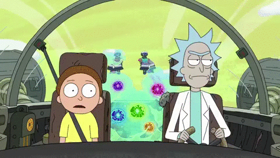

# **Rick and Morty!**

## Índice

* [1.Resumo do projeto](#1-resumo-do-projeto)
* [2. Definições do projeto](#2-definições-do-projeto)
* [3. Protótipo de alta fidelidade](#3-protótipo-de-alta-fidelidade)
* [4. Paleta de cores](#4-paleta-de-cores)
* [5. Histórias de usuário](#5-histórias-de-usuário)
* [6. Testes Unitários](#6-testes-unitários)
* [7. Ferramentas e metodologia aplicada](#7-ferramentas-e-metodologia-aplicada)
* [8. Aprendizado adquirido](#8-aprendizado-adquirido)
* [9. Desenvolvedoras](#9-desenvolvedoras)

***

## 1. Resumo do projeto

O objetivo deste projeto é desenvolver uma página web onde o usuário consiga visualizar um conjunto de dados referente aos personagens da série Rick and Morty, que atendam suas necessidades e que possibilitem seu acesso a informações relevantes sobre os personagens onde poderá filtrar, ordenar e buscar. Exibindo em cards essas informações e também visualizar informações relevantes através de cálculos agregados.

### Sobre a série Rick and Morty 

Rick and Morty é uma série de animação adulta norte-americana de comédia e ficção científica, a série se originou de uma paródia animada em curta-metragem do filme 
De Volta Para o Futuro criada por Roiland para o festival de cinema Channel 101. A Adult Swim abordou Harmon a respeito de ideias para um programa de televisão, então ele e Roiland desenvolveram o programa com base no curta, substituindo os personagens de Doc com Rick e Marty com Morty.
A série estreou em 2 de dezembro de 2013 e acompanha as perigosas aventuras do cientista alcoólatra Rick e seu neto Morty, que divide seu tempo entre a vida familiar e viagens interdimensionais. 

## 2. Definição de Projeto
 							
Este projeto foi idealizado para atender a necessidade do público fã da série Rick and Morty em ter acesso a informações descritivas e filtradas de seus personagens favoritos de maneira ágil e clara. Permitindo assim que o usuário possa acessar informações através de cards podendo filtrar por informações específicas como: espécie, gênero ou status de vivo ou morto, assim sanando suas curiosidades.

## 3. Protótipo de alta fidelidade
Desenhamos uma Interface de Usuário e para isso, utilizamos o Figma e apresentamos o que seria o esperado para nosso projeto.

## 4. Paleta de cores

Paleta de cores do projeto é baseada nas cores da série.

## 5. Histórias de usuários

Ao elaborar as histórias de usuário, pensamos em qual seria o interesse do usuário ao acessar a página, quais informações ele gostaria de consultar e em como seria a interação com a página e suas funcionalidades.  

1."O usuário gostaria de ver os personagens da série exibidos na tela em cards, para que consiga visualizar e conhecer cada um deles."

**Critérios de aceitação:**
Apresentar na interface cards com a imagem dos personagens.

2."O usuário gostaria de ter informações mais completas sobre os personagens como: espécie, gênero e status, para conhecer detalhes sobre seus personagens favoritos."

**Critérios de aceitação:**
O usuário consegue filtrar informações por espécie, gênero e status.

3."O usuário está em busca de agilidade gostaria de realizar busca pelo nome do personagem para visualizar somente os cards que tem mais interesse."

**Critérios de aceitação:**
Mostrar na tela os cards referentes ao nome buscado, mostrando todos os cards que incluem o termo da busca.

4."Buscando mais agilidade o usuário gostaria de exibir na tela os personagens em ordem alfabética crescente e decrescente e também exibir na tela a porcentagem de personagens selecionados em cada filtro."	

**Critérios de aceitação:**
O usuário consegue ver os cards em ordem alfabética na tela.
O usuário consegue exibir na tela a porcentagem referente a cada filtro.	

## 6. Testes Unitários

## 7. Ferramentas e metodologia aplicada

## 8. Aprendizado adquirido

## 9. Desenvolvedoras
