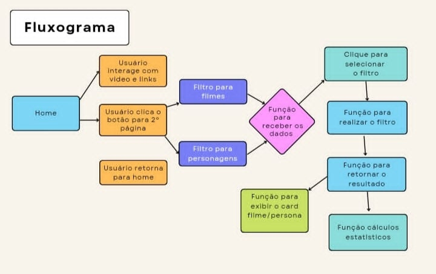
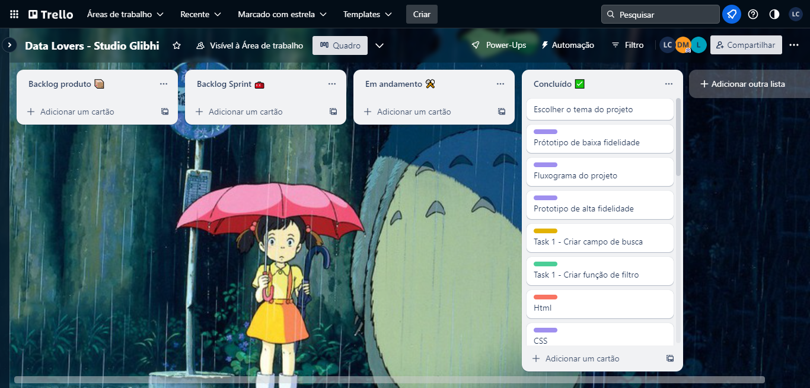
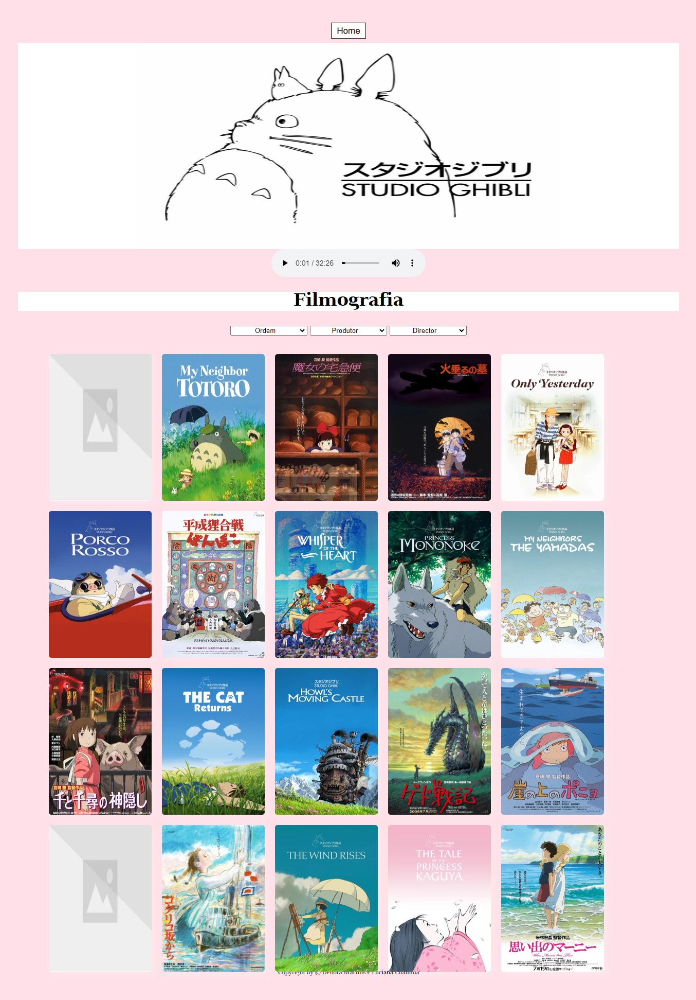
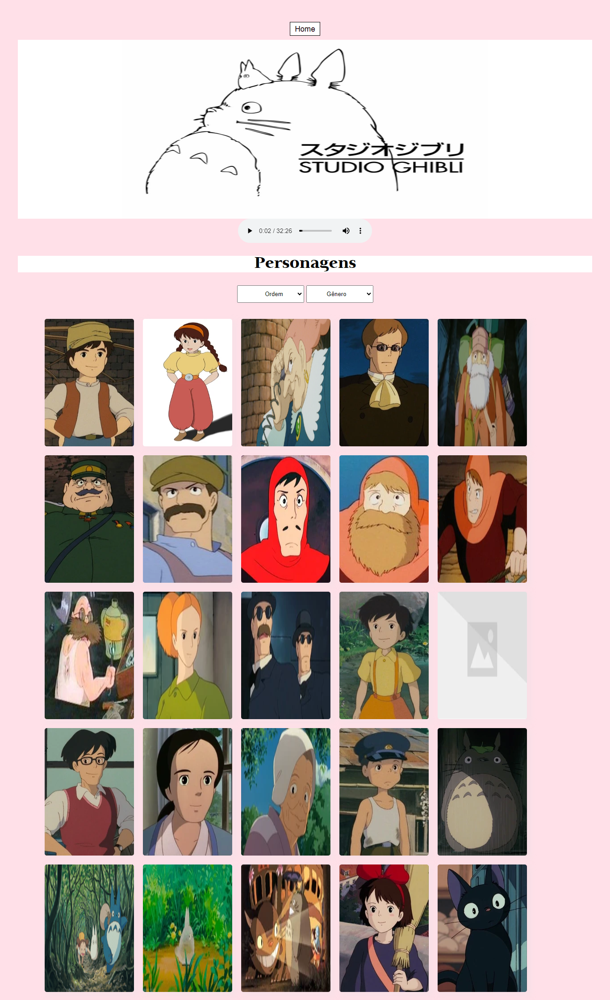
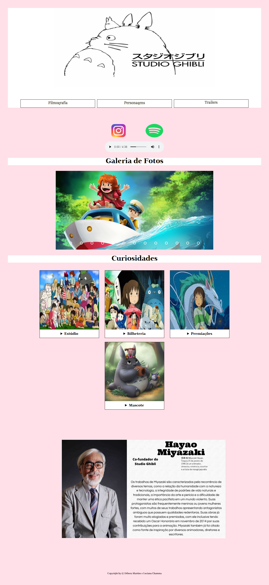

# Data Lovers - Studio Ghibli

# [ Link do Projeto em funcionamento](https://deboramds.github.io/SAP008-data-lovers/src/index.html)

O objetivo principal deste projeto é que aprenda a desenhar e construir uma interface web onde se possa visualizar e manipular dados, entendendo o que o usuário necessita.

## Índice

- [Data Lovers - Studio Ghibli](#data-lovers---studio-ghibli)
- [ Link do Projeto em funcionamento](#-link-do-projeto-em-funcionamento)
  - [Índice](#índice)
  - [1. Introdução ao Projeto](#1-introdução-ao-projeto)
  - [2. Histórias de Usuários](#2-histórias-de-usuários)
  - [3. Desenvolvimento da interface](#3-desenvolvimento-da-interface)
  - [4. Conteúdos implementados no projeto](#4-conteúdos-implementados-no-projeto)
  - [5 . Tecnologias e Ferramentas Utilizadas](#5--tecnologias-e-ferramentas-utilizadas)
  - [6 . Colaboradoras](#6--colaboradoras)

***

## 1. Introdução ao Projeto

Projeto proposto no bootcamp da Laboratória. Proposta do projeto, construir uma página web para visualizar um conjunto (set) de dados que se adeque às necessidades do usuário do tema escolhido.

A escolha do tema para o projeto foi o Studio Ghibli.

Studio Ghibli é um estúdio japonês de animação, muito conhecido por seus filmes como Meu Amigo Totoro, A Viagem de Chihiro, O Castelo Animado, entre outros grandes sucessos. As animações são bem recebidas em todo o mundo e algumas receberam várias nomeações e prêmios. De todo esse fandom há um grupo que deseja interagir e ver as informações das animações e seus personagens.

Primeiramente, fizemos um fluxograma, para organizarmos cada etapa do projeto :

Depois utilizamos o Trello para organizar cada etapa, desenvolvimento e conclusão .

A partir dessa proposta definimos que o site seria dividido em 4 páginas:

Pagina Inicial - Pensando na Fanbase do estúdio, implementamos dois links externos, um onde o fã é redirecionado a playlist dos filmes no spotify, e o outro onde é levado ao instagram oficial, para poderem apreciar imagens de seus filmes favoritos . 
    Ainda na página principal temos três botões, onde são direcionados para outras páginas, que são elas de filmes, traillers e personagens .

Página de filmes - Possibilita a visualização de todos os filmes do estúdio com detalhes sobre cada um. Os filmes podem ser filtrados por diretor e produtor e ordenados de A-Z e Z-A .

Página de Personagens - Apresenta cards com todos os personagens que podem ser filtrados por gênero, masculino e feminino, nessa filtragem temos o cálculo em porcentagem de quantos personagens tem de cada gênero .

Página de trailers -Nesta página temos todos trailers dos famosos filmes do estúdio . 

## 2. Histórias de Usuários

Uma História de Usuário representa em linguagem simples o que o usuário faz, do que ele precisa e por que, de maneira concisa. As histórias para esse projeto foram escritas pensando nas necessidades de nosso usuário final. A medida que o projeto avançava, algumas histórias foram subdivididas, tendo como objetivo organizar melhor as tarefas e atender aos requisitos da aplicação.

Algumas das averiguações levadas em consideração para o desenvolvimento destas histórias são:

Studio Ghibli tem várias animações e para nossos usuários é importante saber quantas e quais são
As mentes por trás de cada animação são os diretores e produtores, sendo que eles podem ter contribuído na criação de mais de uma obra. Portanto, é importante para nosso usuário poder conhecê-los e saber quantas e quais são as criações em que eles trabalharam
As animações possuem informações relevantes para nossos usuários, como descrição, data de lançamento, diretor, produtor e personagens
Cada animação tem seus personagens e para nossos usuários é importante saber quantos e quais são
Os personagens têm características únicas que o usuário deseja conhecer, como nome, idade, sexo, espécie, etc.

## 3. Desenvolvimento da interface

Após a primeira análise do projeto e dados disponíveis, fizemos o primeiro protótipo de baixa fidelidade . Decidimos que nossa Home Page contária com informações que o público se interessaria em ler, escutar e ver .

Posteriormente fizemos o protótipo de alta fidelidade no Figma . Nele dividimos em duas telas, a inicial como o protótipo de baixa fidelidade, e a segunda , onde teriamos os posters e informações dos filmes . 

No decorrer do projeto decidimos efetuar algumas mudanças em nosso projeto . A paleta de cores utilizada priorizou a cor rosa, com ilustrações de personagens dos filmes.

A paleta de cores do filme A Viagem de Chihiro, foi usada como inspiração para a escolha das cores.

Imagens do Projeto Final :

## 4. Conteúdos implementados no projeto 

Para construir a interface desta aplicação, em que é possível visualizar e manipular dados, os conhecimentos abordados foram:

HTML e CSS
Uso de HTML semântico.
Uso de seletores de CSS.
Construir sua aplicação respeitando o desenho realizado (protótipo).
Uso de flexbox em CSS.
DOM e Web APIs
Uso de seletores de DOM.
Gerenciamento de eventos de DOM.
Manipulação dinâmica de DOM. (appendChild |createElement | createTextNode| innerHTML | textContent | etc.)
JavaScript
Uso de condicionais (if-else | switch | operador ternário)
Uso de laços (for | for..in | for..of | while)
Uso de funções (parâmetros | argumentos | valor de retorno)
Manipular arrays (filter | map | sort | reduce)
Manipular objects (key | value)
Uso ES modules (import | export)
Diferenciar entre expression e statements.
Diferenciar entre tipos de dados atômicos e estruturados.
Testing
Teste unitário.
Estrutura do código e guia de estilo
Organizar e dividir o código em módulos (Modularização)
Uso de identificadores descritivos (Nomenclatura | Semântica)
Uso de linter (ESLINT)
Git e GitHub
Uso de comandos de git (add | commit | pull | status | push)
Gerenciar repositórios de GitHub (clone | fork | gh-pages)
Colaboração no Github (branches | pull requests | |tags)

## 5 . Tecnologias e Ferramentas Utilizadas

Js

Node

HTML

CSS 

Figma 

Vscode 

Github 

Git

Trello

Canva

## 6 . Colaboradoras

Débora Martins

Luciana Chamma Baptista

