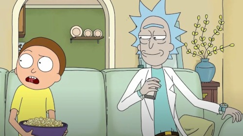
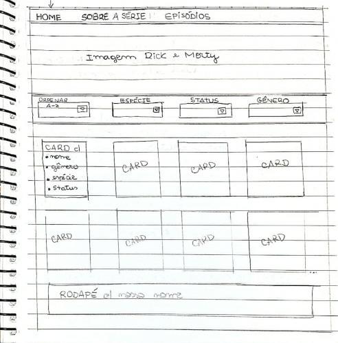
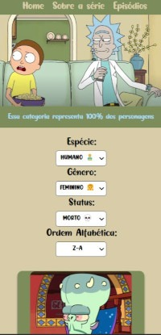
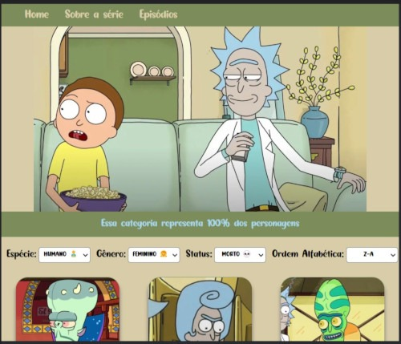

# Data Lovers - Rick and Morty

## Índice

  - [1. Sobre o projeto](#1-sobre-o-projeto)
  - [2. Objetivos de aprendizagem](#2-objetivos-de-aprendizagem)
  - [3. Interface do usuário](#3-interface-do-usuário)
  - [4. História do usuário](#4-história-do-usuário)
  - [5. Protótipo de alta fidelidade](#5-protótipo-de-alta-fidelidade)
  - [6. Responsividade do site](#6-responsividade-do-site)

***

## 1. Sobre o projeto

Neste projeto temos como objetivo visualizar um conjunto de dados que se adeque 
às necessidades de seu usuário.

Como objetivo final temos uma página web que permite visualizar dados,
filtrá-los, ordená-los e fazer algum cálculo agregado. Por cálculo agregado
nos referimos aos diversos cálculos que podem ser feitos com os dados para
mostrar a informação mais relevante para os usuários (médias, valores máximos e
mínimos, etc).

Escolhemos trabalhar com o conjunto de dados da série de televisão, Ricky and Morty.
A série é muito bem recebida mundialmente, e de todo esse grupo de fãs, há um grupo 
que quer ser capaz de interagir e ver as informações dos personagens e da série 
em geral.

## 2. Objetivos de aprendizagem

O objetivo principal deste projeto é aprender a desenhar e construir uma
interface web onde se possa visualizar e manipular dados, entendendo o que o
usuário necessita.

- [ ] **Uso de HTML semântico**

- [ ] **Uso de seletores de CSS**

- [ ] **Empregar o modelo de caixa (box model): borda, margem, preenchimento**

- [ ] **Uso de flexbox em CSS**

  
- [ ] **Uso de seletores de DOM**

- [ ] **Manipulação de eventos de DOM**

- [ ] **Manipulação dinâmica de DOM**

- [ ] **Diferenciar entre tipos de dados primitivos e não primitivos**

- [ ] **Manipular arrays (filter, map, sort, reduce)**

- [ ] **Manipular objects (key | value)**

- [ ] **Variáveis (declaração, atribuição, escopo)**

  
- [ ] **Uso de condicionais (if-else, switch, operador ternário)**

- [ ] **Uso de laços (for, for..of, while)**

- [ ] **Uso de funções (parâmetros, argumentos, valor de retorno)**

  
- [ ] **Testes unitários**

- [ ] **Módulos de ECMAScript (ES modules)**

- [ ] **Uso de linter (ESLINT)**

- [ ] **Uso de identificadores descritivos (Nomenclatura | Semântica)**

- [ ] **Diferença entre expression e statements**

- [ ] **Desenhar a aplicação pensando e entendendo a usuária**

- [ ] **Criar protótipos para obter feedback e iterar**

- [ ] **Aplicar os princípios de desenho visual (contraste, alinhamento, hierarquia)**

- [ ] **Planejar e executar testes de usabilidade**

## 3. Interface do usuário

Iniciamos a interface criando nosso protótipo de baixa fidelidade, pensando 
na experiência do usuário ao navegar pela web.

 

Escolhemos fazer uma interface simples e intuitiva. Escolhemos uma paleta de cores 
suaves para dar uma aparência clean baseada na imagem principal.

 

## 4. História do usuário

Criamos 4 histórias do usuário para nosso projeto.

1) Como um fã recente da série Ricky e Morty, o usuário quer ver as imagens de todos 
os personagens para poder conhecer mais.

2) Dentre tantas espécies mostradas na série, o usuário quer saber os personagens 
de determinadas espécies.

3) O usuário quer encontrar os personagens por ordem alfabética.

4) Ao pesquisar os personagens o usuário quer ver a porcentagem de cada um deles 
em relação ao total

## 5. Protótipo de alta fidelidade

Optamos por trabalhar com a ferramenta Figma para desenvolver o protótipo 
de alta fidelidade

*****IMAGEM DO PROTÓTIPO DE ALTA FIDELIDADE****

Fizemos testes de usabilidade e os usuários acharam simples e as 
informações ficaram expostas de forma clara.

## 6. Responsividade do site

Desenvolvemos um site responsivo pensando nas telas: 

- **Desktop (1400px)**
  
- **Celulares (320px)**

- **Tablet (768px)**
  

