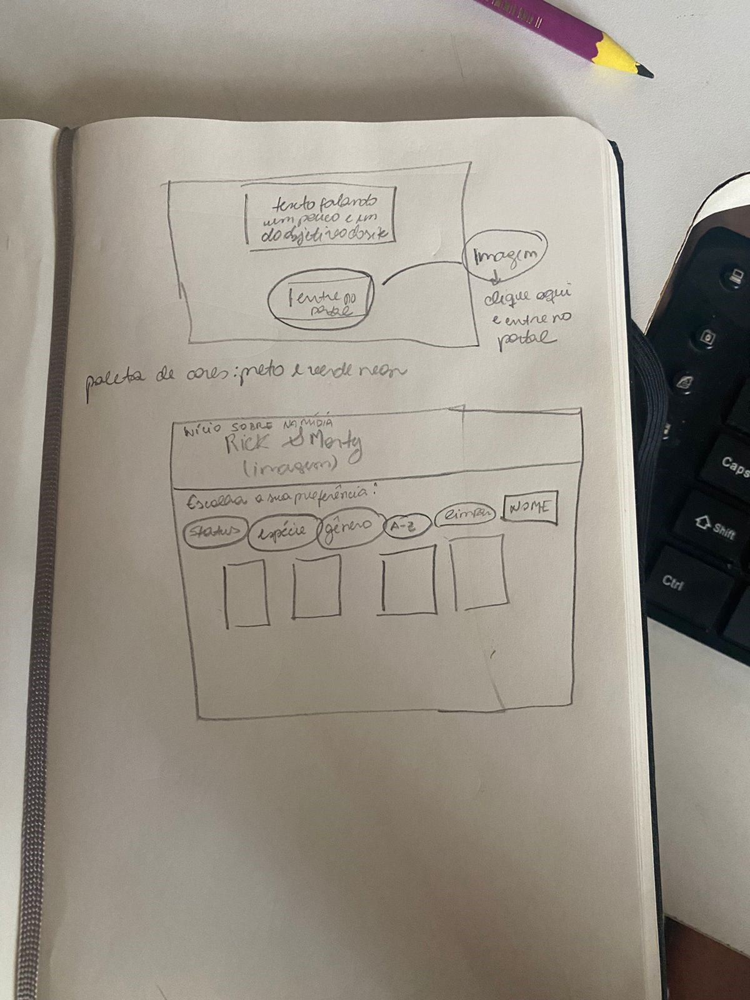

# Data Lovers

## Índice

* [1. Preâmbulo](#1-preâmbulo)
* [2. Resumo do projeto](#2-resumo-do-projeto)
* [3. Histórias de usuário](#3-histórias-do-usuário)
* [4. Protótipos da interface](#4-protótipos-da-interface)
* [5. Testes Unitários](#5-testes-unitários)
* [6. Testes de Usabilidade](#6-testes-de-usabilidade)
* [7. XXXX](#7-considerações-técnicas)
* [8. YYYY](#8-pistas-dicas-e-leituras-complementares)
* [9. ZZZZZ](#9-checklist)

***

## 1. Preâmbulo

Segundo a
[Forbes](https://www.forbes.com/sites/bernardmarr/2018/05/21/how-much-data-do-we-create-every-day-the-mind-blowing-stats-everyone-should-read)
90% dos dados que existem hoje foram gerados durante os últimos dois anos. A
cada dia geramos 2.5 milhões de terabytes de dados, uma cifra sem precedentes.

Apesar disso, os dados por si só são de pouca utilidade. Para que essas grandes
quantidades de dados se convertam em **informação** compreensível para os
usuários, precisamos entender e processar estes dados. Uma forma simples de
fazer isso é criando _interfaces_ e _visualizações_.

Na imagem seguinte, você pode ver como os dados que estão na parte esquerda
podem ser usados para construir a interface amigável e compreensível que está na
parte direita.

## 2. Resumo do projeto

Neste projeto decidimos criar um site dedicado aos fãs de Rick and Morty, 
com o objetivo de catalogar todos os personagens da série, para que dessa forma o
usuário consiga encontrá-los e obter mais informações sobre eles, de maneira fácil e prática.

Iniciou-se o projeto fazendo uma pesquisa sobre o usuário, e concluiu-se que os principais objetivos do usuário em relação ao produto são:

A) Obter mais informações sobre seus personagens favoritos, principalmente sobre seu: nome, gênero, local de origem, espécie, imagem em quantos episódios aparecem e números de episódios.

B) Entretenimento: Utilizam o produto quando querem dar risada, sair um pouco da realidade ou deixar o som da série de fundo.

## 3. Histórias do usuário

Iniciou-se o projeto determinando quatro (4) histórias de usuário:

1 - História 1: "Como fã da série, gostaria de poder visualizar todos os personagens da série para que eu consiga ter acesso as suas principais características de forma mais fácil. "

A partir dessa história, criou-se a funcionalidade de exibir os cards dos personagens na tela.

2 - História 2: “Como fã da série, gostaria de saber quais personagens são alienígenas, pois eu amo ficção científica.”

A partir dessa história, criou-se a funcionalidade do botão espécie, onde o usuário pode verificar a quais espécies pertencem os personagens.

3 - História 3: “Eu como estudante de Ciências Sociais, gostaria de saber a média de quantas personagens femininas existem na série para colocar nos dados do meu TCC.”

A partir dessa história, criou-se a funcionalidade de exibir a porcentagem dos personagens na tela de acordo com o filtro escolhido.

4 - História 4:  “Como fã de Rick and Morty, gostaria muito de encontrar os nomes dos personagens com facilidade, pois tenho muita dificuldade em memorizá-los.”

A partir dessa história, criou-se a funcionalidade de caixa de pesquisa na qual permite o usuário pesquisar o seu personagem pelo nome.

## 4. Protótipos da interface

Após definir as histórias de usuário, criou-se um protótipo de baixa fidelidade como consta na imagem abaixo:

Logo depois, criou-se no Figma um protótipo de alta fidelidade como consta na imagem abaixo:

![esbocoaltafidelidade] (.jpeg)

## 5. Testes unitários

Inicialmente, criou-se um array mock chamado de 'arrayTest' com o objetivo de simular um array para fazer os testes de forma mais prática.

### Teste do objeto rickAndMorty: 
Criou-se um teste para verificar se o objeto 'rickAndMorty', que contém todas as funções principais no data.js, é um objeto.

Logo depois, criou-se testes para as funções de filtro dos personagens por: status, gênero, espécie e busca por nome. 

### Teste de status: 
Primeiramente, criou-se um teste para verificar se o filtro se tratava de uma função. Depois definiu-se um teste para verificar a quantidade de objetos que continham o status 'morto' na array mock. Logo depois, foi testado em qual posição os objetos que continham o status 'morto' se encontravam na array mock. Fizemos o mesmo para testar o status 'vivo'.

### Teste de espécie: 
Criou-se um teste para verificar se o filtro se tratava de uma função. Depois definiu-se um teste para verificar a quantidade de objetos que continham o espécie 'alien' na nossa array mock. Logo depois, foi testado em qual posição os objetos que continham o espécie 'alien'  se encontravam na array mock. Fizemos o mesmo para testar o status 'unknown'.

### Teste de gênero: 
Criou-se um teste para verificar se o filtro se tratava de uma função. Depois definiu-se um teste para verificar a quantidade de objetos que continham o gênero 'female' na array mock. Logo depois, foi testado em qual posição os objetos que continham o gênero 'female'  se encontravam na array mock. 

### Teste de buscar por nome: 
Criou-se um teste para verificar se o filtro se tratava de uma função. Além disso, definiu-se um teste para verificar a quantidade de objetos que continham o nome 'Rick' na array mock.

### Teste para ordenar: 
Criou-se um teste para verificar se a função de ordenar se tratava de uma função. Além disso, definiu-se um teste para verificar a quantidade de objetos que retornavam na array mock quando a função era chamada. Por fim, criou-se um teste para verificar os objetos que retornavam os nomes dos personagens em ordem alfabética de forma crescente e descrescente.

## 6. XXXXXXX

## 7. YYYYYYYY

## 9. ZZZZZZZ
