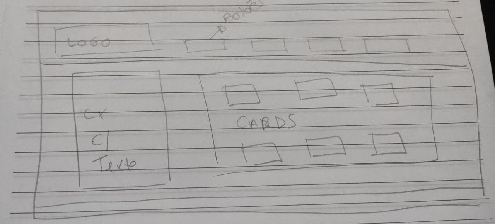
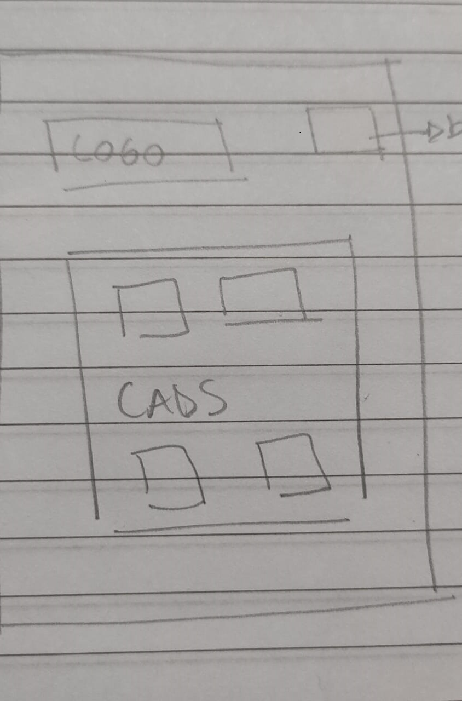
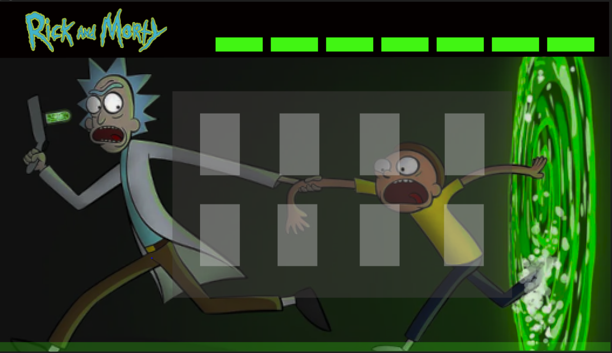
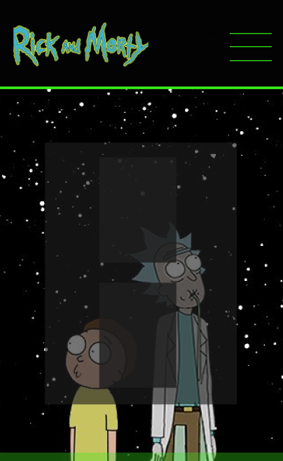

## 1. Preâmbulo

Segundo a
[Forbes](https://www.forbes.com/sites/bernardmarr/2018/05/21/how-much-data-do-we-create-every-day-the-mind-blowing-stats-everyone-should-read)
90% dos dados que existem hoje foram gerados durante os últimos dois anos. A
cada dia geramos 2.5 milhões de terabytes de dados, uma cifra sem precedentes.

Apesar disso, os dados por si só são de pouca utilidade. Para que essas grandes
quantidades de dados se convertam em **informação** compreensível para os
usuários, precisamos entender e processar estes dados. Uma forma simples de
fazer isso é criando _interfaces_ e _visualizações_.

Na imagem seguinte, você pode ver como os dados que estão na parte esquerda
podem ser usados para construir a interface amigável e compreensível que está na
parte direita.

## 2. Resumo do projeto

   Neste projeto construímos uma página web dedicada aos fãs de Rick and Morty, com objetivo de trazer informações filtradas de seus personagens favoritos.
  Ao iniciar o projeto, através de nossas pesquisas, resolvemos atender o objetivo de nosso público fã da série, trazendo então informações sobre cada personagem detalhada através de cards, de uma forma interativa contendo imagens, nomes,  status, espécie, gênero, local e origem.
## 3. História de usuário
  Iniciamos determinando duas histórias de usuários.
### HISTÓRIA 1 : “ Rick and Morty é uma série de televisão de animação americana para adultos. Como fã da série gostaríamos de fornecer informações e interação para os usuários referente aos personagens.”

  A partir dessa história criou-se algumas funcionalidades para facilitar buscas através de botões onde filtram apresentam: Todos os personagens, Vivos, por espécies, mortos e desconhecidos.
- ### HISTÓRIA 2 : “ Como fã da série gostaria de ter acesso a quantidades de personagens e porcentagem de cada característica."

  A partir dessa história agregamos  diversos valores que podem ser  
  feitos com os dados para exibir as informações mais relevantes para as máximas e possíveis referências 
dos porcentagens em porcentagens e de forma alfabética para facilitar a busca por nomes dos favoritos.
## 4. Protótipo de interface
 ## DEFINIÇÃO DE PROTÓTIPO DE BAIXA FIDELIDADE
 
PROTÓTIPO DESKTOP

PROTÓTIPO MOBILE

## DEFINIÇÃO DE PROTÓTIPO ALTA FIDELIDADE

PROTÓTIPO DESKTOP

PROTÓTIPO MOBILE

## 5. Testes unitários

Para criar testes criamos um array ‘mockList’ com objetivo de simular array para realizar os testes de uma forma prática.
  Foi criado um teste para verificar se o objetos ‘mockList’ que contém as principais funções em data.js.

  Foi criado também teste para as funções de filtro dos personagens por: personagens vivos, mortos, desconhecidos, ordenação crescente e decrescente e teste de porcentagem. Todos os testes foram criados para verificar se o filtro tratava-se de uma função.
### Personagens vivos: 

  O primeiro teste criado para verificar
a função de filtro com objetivo de filtrar personagens vivos. 
### Personagens por espécies: 

  Criado na sequência  teste para verificar
a função de filtro com objetivo de filtrar personagens por espécies.
###  Personagens mortos:

  Criado na sequência teste para verificar
a função de filtro com objetivo de filtrar personagens por mortos.
### Personagens desconhecidos:

  Criado na sequência teste para verificar
a função de filtro com objetivo de filtrar personagens desconhecidos.

### crescente: 

  Criado na sequência teste para verificar
A função de filtro com objetivo de filtrar personagens por ordem crescente de A-Z.
### Decrescente: 

  Criado na sequência teste para verificar
A função de filtro com objetivo de filtrar personagens por ordem decrescente de Z-A.
### Testes de porcentagem:

  Criado na sequência teste para verificar
A função de filtro com objetivo de filtrar porcentagem de cada filtro acima informado.
### TESTE DE USABILIDADE

  Nos testes de usabilidade detectamos alguns dos principais erros encontrados por usuários durante o processo de criação do projeto, onde foram solucionados conforme o andamento da construção.
  ## 1*
   O primeiro problema foi a responsividade do site para aparelhos de celular, onde a configuração dos botões apareciam ocupando uma parte grande em telas menores. Desta forma foi modificado as tags de input para uma lista com links.  
  ## 2*
   O segundo problema foi a forma que os cards apareciam na tela do celular, com informações de um texto inicial, que causavam uma poluição visual, atrapalhando uma boa visualização das informações. 