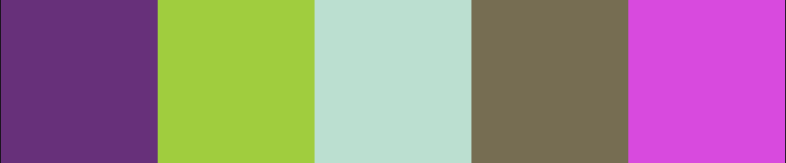

# Dashboard Rick and Morty - Projeto Data Lovers

[Projeto aqui](https://devgabrielasene.github.io/data-lovers/)

## Índice

* [1. Resumo do projeto](#1-resumo-do-projeto)
* [2. Definição do produto](#2-definição-do-produto)
* [3. Web Aplicação](#3-web-aplicação)
* [4. Repositório](#4-repositório)
* [5. Deploy](#5-deploy)
* [6. Checklist](#6-checklist)
***

## 1. Resumo do projeto

Segundo a [Forbes](https://www.forbes.com/sites/bernardmarr/2018/05/21/how-much-data-do-we-create-every-day-the-mind-blowing-stats-everyone-should-read)
90% dos dados que existem hoje foram gerados durante os últimos dois anos. A
cada dia geramos 2.5 milhões de terabytes de dados, uma cifra sem precedentes.

Apesar disso, os dados por si só são de pouca utilidade. Para que essas grandes
quantidades de dados se convertam em **informação** compreensível para os
usuários, precisamos entender e processar estes dados. Uma forma simples de
fazer isso é criando _interfaces_ e _visualizações_.

Dado contexto, desenvolvemos uma aplicação web que interaja com os usuários, desde os leigos, até os fãs da renomada série animada Rick and Morty, utilizando referências aplicadas ao design de interação. A ideia foi construir uma página web inspirada num modelo de dashboard, ou seja, um painel personalizado para visualização de informações avindas de dados existentes. Através de uma interface lúdica e autodidata, nossos usuários conseguem navegar pelos cards da página e ao passar a seta por cima de algum, por meio de um efeito page flip, terá acesso à informações do respectivo personagem como: nome, status, espécie, gênero e localização. Além disso, nosso usuário tem a possibilidade de utilizar filtros para uma melhor seleção das informações que deseja acessar, inerente à ordem alfabética dos dados, de acordo com sua escolha, ou até mesmo para uma busca mais assertiva, utilizar o campo de busca.
### Rick and Morty

Rick & Morty é uma série animada de comédia que mostra as aventuras interdimensionais de Rick, a mente mais brilhante da galáxia, e seu neto Morty. Com sua arma capaz de criar portais para viajar no tempo-espaço, Rick leva Morty para explorar todos as absurdas formas de vida que o universo é capaz de sustentar. 

## 2. Definição de produto

Pensando na legião de fãs da série, mas também naqueles que apesar de ainda leigos, são atravessados pela repercussão da série, as informações trazidas atuam como uma dashboard, a fim de contemplar as diversas faces de nossos potenciais usuários. São essas:

  • imagem associada ao personagem em questão
  • nome do personagem
  • status de vida
  • gênero
  • espécie
  • localização
  • número de personagens total e em cada filtro selecionado
  • campo de busca para pesquisas objetivas

  Esses dados são impressos ao usuário logo de inicio na página inicial, por meio do efeito page flip em cada um dos cards, de modo que o usuário possa utilizar os filtros no menu acima para navegar pelas informações desejadas de maneira mais assertiva.

  ### História de usuário

  Foram definadas duas histórias de usuário pensando no uso da dashboard para fins de pesquisa.

  1. "Sou um usuário que está no ensino médio e precisa pesquisar quais espécies da série existem para um trabalho escolar e quantos personagens existem de cada espécie."
    Cenário: Dado que estou na página inicial, vou selecionar o filtro de "espécies" para ter acesso às mesmas.
  2. "Sou um usuário que deseja saber quantos e quais personagens estão vivos."
    Cenário: Dado que estou na página inicial, vou selecionar o filtro "status", logo a opção "vivo" e então terei acesso às informações que desejo.

  ### Definição de resultado

  À utilizar às histórias de usuário como parâmetro para desenvolver o projeto, foi necessário obter para definição de resultado, escopo inerente a cada uma das histórias.
   1. Para que esta seja atendida, foi necessário:
      • imprimir a exibição dos cards na tela trazendo as informações associadas aos personagens
      • um filtro capaz de filtrar as "espécies" já trazendo a informação dos tipos de espécies existentes
      • um cálculo que traga a informação de quantidade de personagens existentes naquela categoria

   2. Para que esta seja atendida, foi necessário:
      • imprimir a exibição dos cards na tela trazendo as informações associadas aos personagens
      • um filtro capaz de filtrar o "status" entre "vivo" e "morto" dos personagens
      • um retorno na tela ao clicar em "vivo" trazendo os personagens vivos da série
      • um cálculo dentro desse filtro que traga a quantidade de personagens vivos nessa tela

### 3. Web Aplicação

Ao pensar em interface aplicativa para este projeto, foi definido cores e tipografias que dialogassem com o tema, pensando em levar conforto e boa impressão aos nossos usuários, sem trabalhar com demasiado colorismo e trazendo tipografias universais para que nossos usuários, em diferentes máquinas e locais, tivessem uma experiência semelhante. Para isso, utilizamos uma fonte universal da Google Fonts [Patua One](https://fonts.googleapis.com/css2?family=Patua+One&display=swap) em todo o design. 

O layout conta com a [logo](/titulose.png) de Rick and Morty no `<header>`, acompanhado de um menu ao qual "C-137" faz referência a "Home", já que na série C-137 é a terra na dimensão conhecida pelos humanos, portanto, este botão leva a página inicial da web. Em sequência, temos o botão "More" qu trás informações sobre a dashboard de Rick and Morty e como utilizá-la, por fim, temos o botão "Multiverso" direcionando para uma página de HTML contendo informações sobre as desenvolvedoras do projeto, uma associação por "transportar" para outro HTML. 
Abaixo da header, nosso `<body>` traz os botões `<select>` que dão origem aos nossos filtros `Status` (vivo/morto/indefinido), `Gênero` (feminino/masculino/indefinido),`Espécie` (humano/humanóide/alien/animal) e `Ordenar` (A-Z/Z-A). Os cards utilizam o [background-image](espacowe%20copy.jpg) e os demais botões utilizam as cores `#3b065c` e `#000000`, por fim, a cor das fontes foi definida em `#FFF`.

### Protótipos

A prototipagem foi dividida em baixa fidelidade, feito à mão para ter um esboço, e alta fidelidade, feito utilizando a ferramenta [Figma] (https://www.figma.com/) e acessando recursos para desenvolver um protótipo mais fiel ao nosso projeto, pensando em UX e UI.
Abaixo são algumas imagens de ambos protótipos, tanto na versão desktop, quanto versão mobile: 
  
  • Baixa fidelidade Desktop
  
  .jpeg) 

  • Baixa fidelidade Mobile
  
  
  
  • Alta fidelidade Desktop
  
  .png)

  • Alta fidelidade Mobile
  
  

### Paleta de cores
A paleta de cores foi impressa pelo [Adobe Color](https://color.adobe.com/pt/create/color-wheel): 
 

• Gradiente 

 

## 4. Repositório
O repositório é o espaço digital que armazena um código e as versões que podem advir dele. Neste caso, o repositório está hospedado no GitHub, onde é possível criar um perfil - um espaço próprio do usuário para guardar códigos. O ideal é ter um repositório por projeto. Para tanto, é possível criar um repositório e nomeá-lo ou forkar um repositório já existente (de outro perfil) para fazer as próprias mudanças sem alterar o arquivo original. No caso de um novo repositório criado, é importante acessar a pasta do computador onde o repositório está por meio do terminal e usar o comando `git init` (no caso de GitBash, terminal do Linux, terminal do Ubuntu). Para este repositório cujo README vos fala, isso não é necessário.

### Fork
`Fork` é a ação de bifurcar um repositório, ou seja, é como se o repositório original fosse um bonde com passageiros dentro (códigos) que trilha um caminho que, em dado momento, é bifurcado (fork) e agora segue dois caminhos distintos, porém com um passado em comum. Da mesma forma, o repositório disponibilizado por um Usuário A possui arquivos e códigos que, quando "forkados" por outro Usuário B, seguem o caminho que o Usuário B determinar sem afetar o repositório original, disponibilizado pelo Usuário A. Para acessar este repositório, cujo README vos fala, é preciso forká-lo. Para isso, basta clicar em `Fork`, no canto direito superior da página deste repositório no GitHub.

### Clone
`Clone` é a ação de clonar o repositório forkado para a máquina na qual o(s) código(s) é(são) alterado(s). Clonar o repositório forkado permite que o computador acesse todos os arquivos dentro do repositório clonado. Para clonar o repositório forkado, que, agora, pertence ao usuário que forkou, basta:
- Clicar no botão `Code` **na página do repositório do usuário que forkou**;
- Copiar a url-do-repositório ali disponibilizado; 
- Abrir o Terminal;
- Acessar a pasta para onde deseja clonar o repositório;
- Rodar o comando `git clone <url-do-repositório>`.

### Fork and Knife
Em razão deste projeto ter sido realizado em trio, o `fork` foi feito por apenas uma das partes. A aluna Gabriela Sene realizou o fork, e então as demais integrantes Bruna Lima e Polyana Magalhães, clonaram o mesmo [repositório](https://github.com/devgabrielasene/data-lovers) para suas respectivas máquinas.

## 5. Deploy
`Deploy` é a ação de colocar o código no ar. Quando um código/aplicação é "deployado", significa que ele já está disponível para ser acessado como qualquer outro site, por intermédio da URL colocada na barra de endereço do navegador. Para "deployar", basta:
- Acessar a pasta com os arquivos a serem adicionados no Terminal;
- Rodar o comando `npm run deploy` no Terminal.

## 6. Checklist
* [✓] Usar VanillaJS.
* [✓] Passa pelos testes (`npm test`)
* [✓] Testes unitários cobrem um mínimo de 70% de statements, functions, lines e branches.
* [✓] Inclui uma _definição de produto_ clara e informativa no `README.md`.
* [✓] Inclui histórias de usuário no `README.md`.
* [✓] Inclui rascunho da solução (protótipo de baixa fidelidade) no `README.md`.
* [✓] UI: Mostra lista/tabela/etc com dados e/ou indicadores.
* [✓] UI: Permite ordenar dados por um ou mais campos (asc e desc).
* [✓] UI: Permite filtrar dados com base em uma condição.
* [✓] UI: É _responsivo_.
